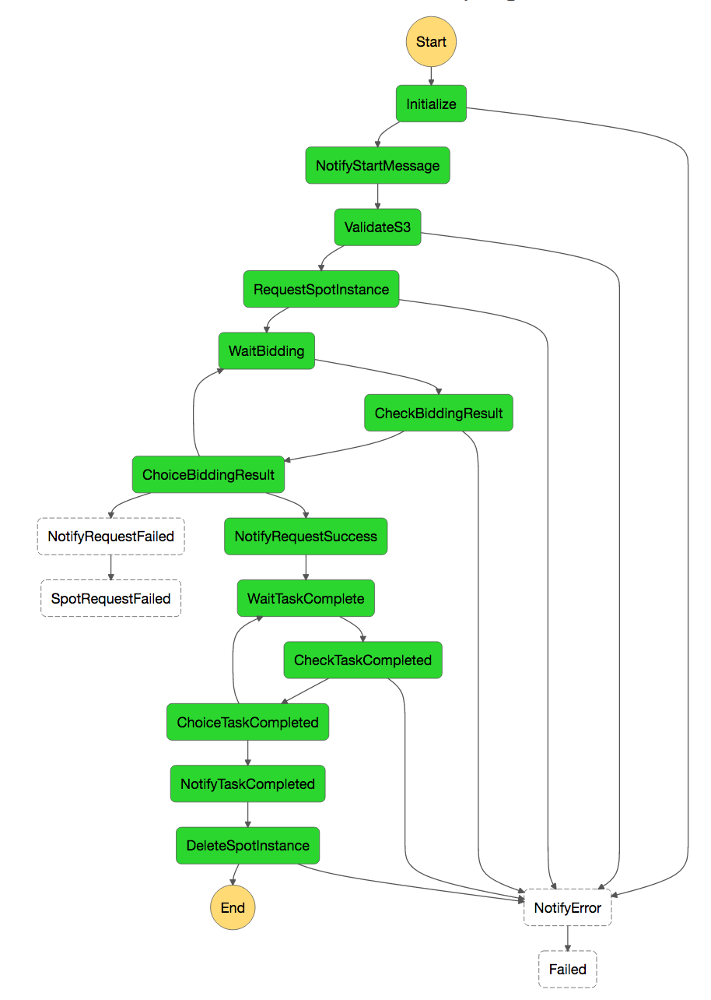

# AWSAutoLearning
AWS の GPU インスタンス等を使った DeepLearning 系の環境構築・学習・撤収等を自動化します

## 概要

以下を自動でやってくれます。

1. 学習開始の通知
1. データ格納先の S3 のチェック
1. スポットインスタンスへの入札と結果通知
1. インスタンス上でのデータダウンロードと学習（もしくは任意のタスク）実行
1. 学習完了後の通知とインスタンス削除

## ベースにした記事・プログラム
このプログラムは [AWS Step FunctionsとLambdaでディープラーニングの訓練を全自動化する](http://mizti.hatenablog.com/entry/deeplearningwithawsstepfunction) を以下の点で自分用に改造したものです。

- 通知をプッシュではなく Slack に
    - 全般的なエラー発生時にも Slack に通知する
- スポットインスタンスの入札が完了するまでループして待機する
- 一つの S3 バケット内に複数の学習結果を格納していく
- 学習完了後、即座にインスタンスを破棄する

